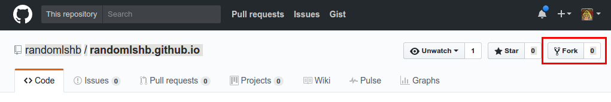
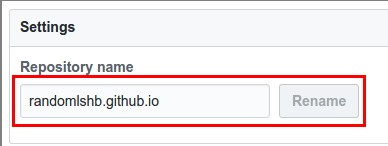
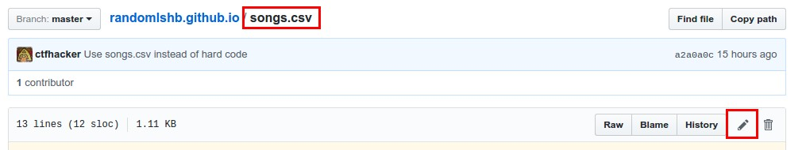

# Harmony Brigade Randomizer

This README assumes no `git` knowledge at all. Everything will be modified using the browser.

The randomizer is hosted by Github as well. If you want to host the randomizer on your own website, scroll down to the bottom of this list.


## Create a Github account for your brigade

```
NOTE: Your username will be your URL (unless you redirect using DNS)
```

## Clone repositiory

Once logged into your account, go to the original [randomihb](https://github.com/randomihb/randomihb.github.io) repository and Click "Fork"



## Edit your own repository

"Forking" the repository gives you a carbon copy of the website.

Head over to your repository at:

```
https://github.com/YOURUSERNAME/randomihb.github.io
```

Click on `Settings`:


Rename your repository to `YOUR ACCOUNT USERNAME` and then click `Rename`:



```
randomihb.github.io -> YOURACCOUNT.github.io
```

## Create your song list

Modify the `songs.csv` file located in your repository.



The format for each line is below:

```
Song Name
Tenor Starting Pitch
Lead Starting Pitch
Bari Starting Pitch
Bass Starting Pitch
Path to the audio file for the pitch to be blown
Letter displayed for the pitch being blown
Starting words
```

For example:
```
Ive Got The World On A String,E,C,Bb,G,audio/FNatural.mp3,F,Im sittin on top of the world
```

```
Song Name - Ive Got The World On A String
Tenor Starting Pitch - E
Lead Starting Pitch - C
Bari Starting Pitch - Bb
Bass Starting Pitch - G
Path to the audio file for the pitch to be blown - audio/FNatural.mp3
Letter displayed for the pitch being blown - F
Starting words - I'm sittin on top of the world
```

Once done modifying, be sure to commit your changes.

## Check out the new website

Once done modifying your songs, head to `http://YOURACCOUNTNAME.github.io` and your new randomizer should be available.

## BONUS - Redirect using DNS

If you want to have your own custom URL for the randomizer instead of the `*.github.io`:

After purchasing the domain you want, create a new file called `CNAME` in the root directory with only the contents of the URL. Point your domain to `YOURACCOUNTNAME.github.io` and everything should magically work.

# Hosting on your website

To host the website yourself, you can generate the source files by invoking [Jekyll](https://jekyllrb.com/).

or..

Download the zip file of the generated source files [here](https://github.com/randomihb/randomihb-source/archive/master.zip). Follow the same steps above for modifying the `songs.csv`.
